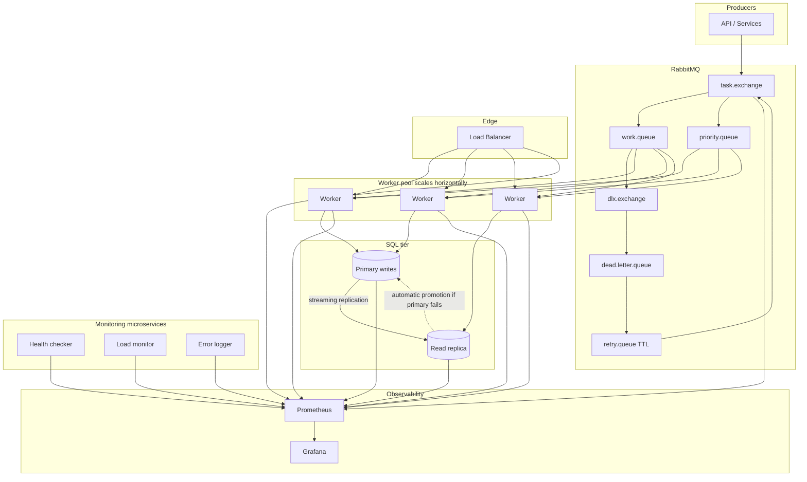

# Distributed Task Processing Architecture

## Design decisions

Task producers publish to a RabbitMQ exchange that fans out to a primary work queue and an optional priority queue so traffic shaping and SLAs stay in the broker layer. Messages that fail processing are routed through a dead-letter exchange into a dead-letter queue; automation or operators move work from the DLQ into a retry queue with TTL that re-publishes to the main exchange, giving bounded retries without blocking live consumers.

Workers scale horizontally: additional instances attach to the same queues and compete for messages. A load balancer sits in front of the worker tier for synchronous health, admin, or callback endpoints while asynchronous consumption still originates from RabbitMQ. Reads that can tolerate lag go to the read replica; writes go to the primary. When the primary fails, the replica is promoted automatically by the database platform or orchestrator so the system keeps a single writable leader.

Prometheus scrapes all long-lived components (workers, load balancer where exposed, RabbitMQ with its exporter, databases with exporters, and the three monitoring services). Grafana queries only Prometheus to keep one metrics source of truth. Splitting health checking, load monitoring, and error logging into small services keeps responsibilities isolated and lets teams scale or replace them independently.
